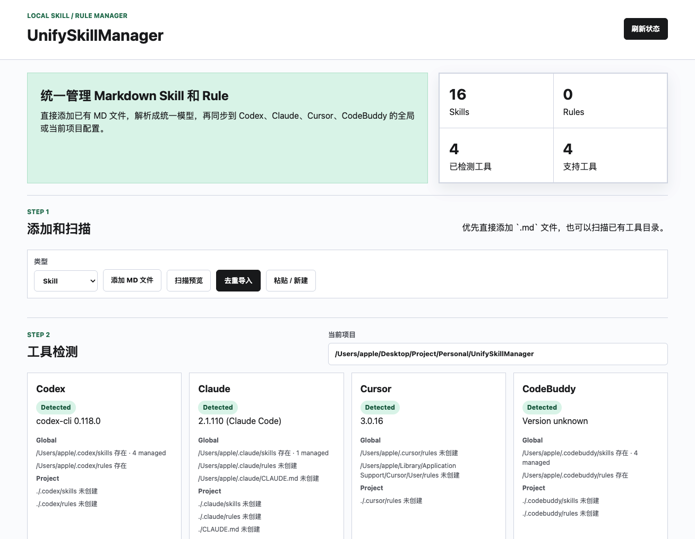
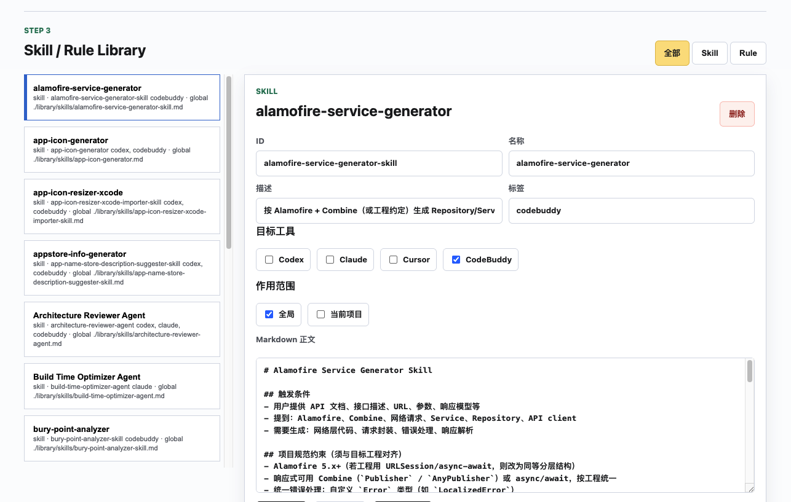

# UnifySkillManager

UnifySkillManager is a local Web manager for AI coding tool Skills and Rules.

It keeps your source content in one Markdown-first library, then syncs selected Skills or Rules to tools such as Codex, Claude, Cursor, and CodeBuddy.





## Features

- Local Web UI, no account system.
- Markdown-first storage. Each Skill or Rule is a `.md` file.
- Add existing Markdown files directly from the Web UI.
- Paste or create Markdown content in the browser when needed.
- Auto-scan existing tool directories and import deduplicated Skills or Rules.
- Parse Markdown with optional YAML frontmatter into a unified model.
- Manage two content types: Skill and Rule.
- Detect Codex, Claude, Cursor, and CodeBuddy installation status, versions, and config paths.
- Sync to global tool config or the current project.
- Preview generated target files before syncing.
- Create backups before overwriting generated files.
- Verify synced files by reading them back and checking the UnifySkillManager marker.

## Supported Tools

| Tool | Skill sync | Rule sync | Notes |
| --- | --- | --- | --- |
| Codex | `skills/{id}/SKILL.md` | `rules/{id}.md` | Supports global and project paths. |
| Claude | `skills/{id}.md` | `rules/{id}.md` | Uses the flat Markdown style detected on this machine. |
| Cursor | Rules-focused | `{id}.mdc` | Cursor rules use `.mdc`. |
| CodeBuddy | `skills/{id}/SKILL.md` | `rules/{id}.md` | Supports global and project paths. |

## Run

```bash
npm start
```

Then open:

```txt
http://127.0.0.1:4310
```

If port `4310` is already in use, run with another port:

```bash
PORT=4311 npm start
```

Then open:

```txt
http://127.0.0.1:4311
```

## How To Use

### 1. Add Markdown

Use the **Add MD File** button to import an existing `.md` file.

The file can be a complete Skill or Rule with YAML frontmatter:

```md
---
id: swiftui-review
type: skill
name: SwiftUI Review
description: Review SwiftUI code for maintainability and performance.
tags:
  - swiftui
  - ios
targets:
  - codex
  - cursor
scope:
  - global
  - project
enabled: true
version: 1.0.0
---

# SwiftUI Review

Use this skill when reviewing SwiftUI code.
```

It can also be a simple Markdown file:

```md
# SwiftUI Review

Use this skill when reviewing SwiftUI code.
```

When frontmatter is missing, UnifySkillManager will infer a basic `id`, `name`, and `type`.

### 2. Scan Existing Tools

Click **Scan Preview** to scan common local tool directories without writing anything.

Click **Deduplicated Import** to import non-duplicate candidates into the local library.

The scanner is intentionally conservative. It scans known Skill and Rule locations instead of the whole computer, and avoids importing support files such as `references/`, `templates/`, `assets/`, and `scripts/`.

### 3. Edit A Skill Or Rule

Select an item from **Skill / Rule Library**.

You can edit:

- ID
- Name
- Description
- Tags
- Target tools
- Scope: global or current project
- Markdown body

Click **Save Changes** to persist the changes back to the source Markdown file.

### 4. Preview Output

Click **Preview Output** to see the exact files that would be written to each selected tool and scope.

This is useful before syncing because different tools use different file layouts.

### 5. Sync To Tools

Select target tools and scopes, then click **Sync To Tools**.

The sync flow:

1. Saves the current Skill or Rule metadata back to the source Markdown file.
2. Renders tool-specific target files.
3. Creates the target directory when needed.
4. Backs up an existing target file before overwriting it.
5. Writes the generated file.
6. Reads the file back and verifies it contains the UnifySkillManager marker.

Synced files include this marker:

```md
<!-- Managed by UnifySkillManager. Manual edits may be overwritten. -->
```

The UI reports the target path, byte size, and verification result.

### 6. Confirm Sync

There are three practical checks:

1. The sync result says `written and verified`.
2. The target path exists on disk.
3. The target file contains the UnifySkillManager marker.

The tool detection panel also shows how many managed files exist under each detected config path.

## Storage

```txt
library/
  skills/
  rules/
backups/
config/
screenshot/
```

- `library/skills` and `library/rules` are the source of truth.
- `backups` stores previous versions of overwritten target files.
- `config` is reserved for local config and future cache files.
- `screenshot` stores project screenshots used by documentation.

## Notes

- A successful sync means the file was written and verified on disk.
- Some tools may need a window reload, workspace reload, or new session before they load newly synced Skills or Rules.
- Tool-specific Skill and Rule formats can evolve, so adapters should be kept small and easy to update.
